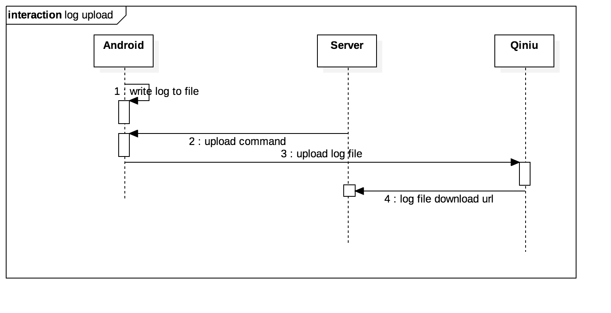

# 自己动手写一个日志上报系统

第一份工作的时候（Android QQ开发），经常遇到线上bug需要解决，最常使用的办法是找用户要QQ号码，通过QQ号码在日志平台给用户日志设置为染色级别，然后设置日志开始和结束时间，上传用户的日志。现在的项目因为没有搭建类似的日志平台，所以动手写一个吧。日志系统包括日志记录、日志打包、下发日志指令、上传日志文件、下载日志文件等几个步骤。

流程大概是这个样子的： 

## 保存Android端日志到文件

一般的做法是使用log工具类，比如xlog，将每次输出的日志打印到文件中，这样的缺点是不能收集系统日志，只能输出开发自己添加的日志，我的做法是复制logcat输出的日志，这样可以输出所有的日志信息，对应定位问题的帮助更大。

logcat是adb中查看系统日志的命令，Android的日志全部放到一个缓冲区中，想要得到这些日志可以使用命令

```
logcat -d -v time
```

清除日志使用命令

```
logcat -c
```

更多命令可以参考[logcat命令行工具](https://developer.android.com/studio/command-line/logcat.html)

Android代码将日志写到文件中

```
public static void writeLogCat(Context context) {
    try {
        Process process = Runtime.getRuntime().exec("logcat -d -v time");
        BufferedReader bufferedReader = new BufferedReader(new InputStreamReader(process.getInputStream()));
        StringBuilder log = new StringBuilder();
        String line;
        while ((line = bufferedReader.readLine()) != null) {
            log.append(line);
            log.append("\n");
        }
        new ProcessBuilder().command("logcat", "-c").redirectErrorStream(true).start();
        File file = logFile(context);
        RandomAccessFile randomFile = new RandomAccessFile(file.getAbsolutePath(), "rw");
        while (log.length() > MAX_LEN) {
            long fileLength = randomFile.length();
            randomFile.seek(fileLength);
            String content = log.substring(0, MAX_LEN);
            log = log.delete(0, MAX_LEN);
            randomFile.writeUTF(content);
        }
        long fileLength = randomFile.length();
        randomFile.seek(fileLength);
        randomFile.writeUTF(log.toString());
        randomFile.close();
    } catch (IOException e) {
        e.printStackTrace();
    } catch (OutOfMemoryError e) {
        e.printStackTrace();
    } catch (Exception e) {
        e.printStackTrace();
    }
}
```

## 根据时间打包日志文件

日志文件的文件名以日期命名，比如 20171229.log, 20171230.log, 根据时间段查找日志时可以根据文件名字过滤。以下是获取日志文件File的方法

```
private static File logFileDir(Context context) {
    File sdCard = Environment.getExternalStorageDirectory();
    File dir = new File(sdCard.getAbsolutePath() + File.separator + "Meow"
            + File.separator + context.getApplicationContext().getPackageName());
    if (!dir.exists()) {
        boolean mkdirs = dir.mkdirs();
    }
    return dir;
}

private static File logFile(Context context) {
    File dir = logFileDir(context);
    return new File(dir, LocalDate.now().toString(FORMAT) + ".log");
}
```

## 上传和下载

使用qiniu存储日志文件，使用qiniu sdk上传和下载日志文件
